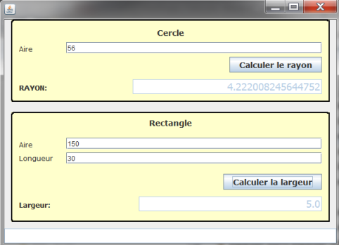
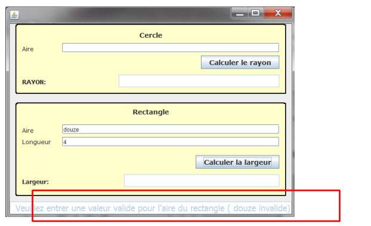
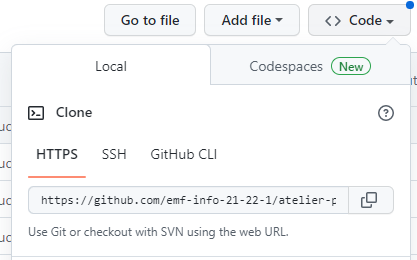

# Contexte 

Le programme `Geometrie-Exceptions` est une application qui permet de trouver le rayon d’un cercle en fonction de son aire, et la largeur d’un rectangle en fonction de son aire et de sa longueur. 

Ce projet est totalement réalisé en respectant le standard MVC. 

# Travail à effectuer
Ce programme est déjà tout à fait fonctionnel. 

Néanmoins, le problème est qu’aucune gestion des exceptions n’y a été faite ! Aussi, il est tout à fait possible que le programme « plante » en fonction des données que l’utilisateur saisira. 

Nous souhaiterions que ces exceptions dues à la saisie de l’utilisateur soient traitées (dans le contrôleur) et qu’au lieu de générer une exception, un message d’information s’affiche à l’utilisateur dans le champ texte au fond de la fenêtre : 

De plus, répondez à la question suivante : 

## Question
« Mais pour quelle raison le programme reçu qui fonctionnait déjà n’avait pas de try/catch afin d’attraper ces exceptions-là ? Car je croyais que le fait qu’une méthode de Java susceptible d’en générer et qui en plus l’indique dans sa signature à l’aide de la clause throws obligerait l’appelant à les traiter non ? »  

## Votre réponse
*indiquer votre réponse ici*

# Réaliser un contrôle par binôme 

Récupérez le projet GitHub de votre collègue. Votre collègue vous transmets l'URL HTTPS du dépôt GitHub : 

 
Vous pouvez réaliser un clone et ensuite
1. tester le programme de votre collègue 
2. Vérifier le code effectuée pour gérer les exceptions 

Réaliser ensuite un échange orale sur le travail de chacun suite au test et corriger si-nécessaire. 
